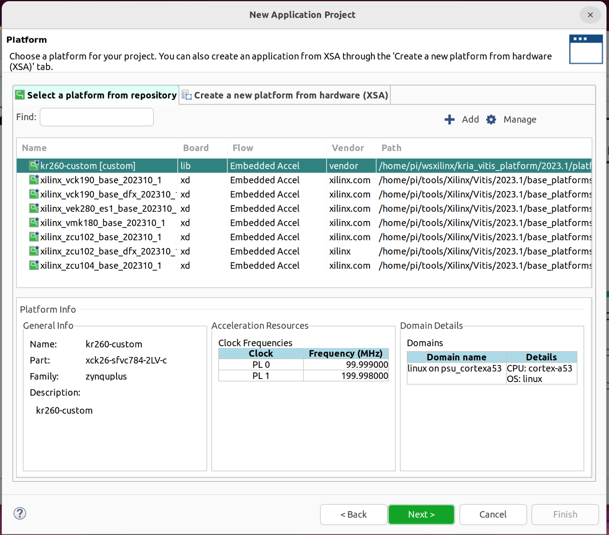

# Create accellerated computing

## Step 1 : Create hardware platform

1.1 Getting Started with the Kria KR260 (Custom HW)
https://www.hackster.io/whitney-knitter/getting-started-with-the-kria-kr260-in-vivado-2022-1-33746d
1.2 Add Peripheral Support to Kria KR260 
https://www.hackster.io/whitney-knitter/add-peripheral-support-to-kria-kr260-vivado-2022-1-project-874960

Output :

xsa platform file

## Step 2 : Create Petalinux image

The output from this step will be used in subsequence step. 
These three files will be used in Vitis platform and Vitis apllication

1. Petalinux Kernel
   ```
   Image
   ```
3. Root file system
   ```
   ext4
   ```
5. Sysroot
   ```
   sysroot directory
   ```

The SD-Card image to burn a SD-Card

wic file
```
petalinux-sdimage.wic
```

Device tree overlay to use in the accelerared application
```
/dtg_output/dtg_output/kria_kr260/psu_cortexa53_0/device_tree_domain/bsp/pl.dtbo
```

https://www.hackster.io/whitney-knitter/getting-started-with-the-kria-kr260-in-petalinux-2022-1-daec16

```
petalinux-create --type project -s xilinx-kv260-starterkit-v2022.1-05140151.bsp
cd xilinx-kv260-starterkit-2022.1/
petalinux-config --get-hw-description ../../hardware/kr260_platform_20231
petalinux-config -c rootfs
```

```
/home/pi/wsxilinx/kria_vitis_platform/2023.1/software/xilinx-kr260-starterkit-2023.1/project-spec/configs/rootfs_config - Configuration
 ─────────────────────────────────────────────────────────────────────────────────────────────────────────────────────────────────────────────────────────
  ┌────────────────────────────────────────────────────────────────── Configuration ───────────────────────────────────────────────────────────────────┐
  │  Arrow keys navigate the menu.  <Enter> selects submenus ---> (or empty submenus ----).  Highlighted letters are hotkeys.  Pressing <Y> includes,  │  
  │  <N> excludes, <M> modularizes features.  Press <Esc><Esc> to exit, <?> for Help, </> for Search.  Legend: [*] built-in  [ ] excluded  <M> module  │  
  │  < > module capable                                                                                                                                │  
  │                                                                                                                                                    │  
  │ ┌────────────────────────────────────────────────────────────────────────────────────────────────────────────────────────────────────────────────┐ │  
  │ │                                         Filesystem Packages   --->                                                                             │ │  
  │ │                                         Petalinux Package Groups  --->                                                                         │ │  
  │ │                                         Image Features  --->                                                                                   │ │  
  │ │                                         user packages   --->                                                                                   │ │  
  │ │                                         PetaLinux RootFS Settings  --->                                                                        │ │  
  │ │                                                                                                                                                │ │  
  │ │                                                                                                                                                │ │  
  │ │                                                                                                                                                │ │  
  │ │                                                                                                                                                │ │  
  │ │                                                                                                                                                │ │  
  │ │                                                                                                                                                │ │  
  │ │                                                                                                                                                │ │  
  │ │                                                                                                                                                │ │  
  │ │                                                                                                                                                │ │  
  │ │                                                                                                                                                │ │  
  │ │                                                                                                                                                │ │  
  │ │                                                                                                                                                │ │  
  │ │                                                                                                                                                │ │  
  │ │                                                                                                                                                │ │  
  │ │                                                                                                                                                │ │  
  │ │                                                                                                                                                │ │  
  │ └────────────────────────────────────────────────────────────────────────────────────────────────────────────────────────────────────────────────┘ │  
  ├────────────────────────────────────────────────────────────────────────────────────────────────────────────────────────────────────────────────────┤  
  │                                              <Select>    < Exit >    < Help >    < Save >    < Load >                                              │  
  └────────────────────────────────────────────────────────────────────────────────────────────────────────────────────────────────────────────────────┘  
```

Then config `rootfs` as in the following


```
Filesystem Packages --> console --> utils --> git --> [*] git
Filesystem Packages --> base --> dnf --> [*] dnf
Filesystem Packages --> x11 --> base --> libdrm --> [*] libdrm
Filesystem Packages --> x11 --> base --> libdrm --> [*] libdrm-tests
Filesystem Packages --> x11 --> base --> libdrm --> [*] libdrm-kms
Filesystem Packages --> libs --> xrt --> [*] xrt
Filesystem Packages --> libs --> xrt --> [*] xrt-dev
Filesystem Packages --> libs --> zocl --> [*] zocl 
Filesystem Packages --> libs --> opencl-headers --> [*] opencl-headers 
Filesystem Packages --> libs --> opencl-clhpp --> [*] opencl-clhpp-dev
Petaliunx Package Groups --> packagegroup-petalinux --> [*] packagegroup-petalinux
Petaliunx Package Groups --> packagegroup-petalinux-gstreamer --> [*] packagegroup-petalinux-gstreamer
Petaliunx Package Groups --> packagegroup-petalinux-opencv --> [*] packagegroup-petalinux-opencv
Petaliunx Package Groups --> packagegroup-petalinux-v4lutils --> [*] packagegroup-petalinux-v4lutils
Petaliunx Package Groups --> packagegroup-petalinux-x11 --> [*] packagegroup-petalinux-x11
```
### Clean and build petalinux

```
pi@piXlinx:~/wsxilinx/kria_vitis_platform/2023.1/software/xilinx-kr260-starterkit-2023.1$ petalinux-build -x mrproper
pi@piXlinx:~/wsxilinx/kria_vitis_platform/2023.1/software/xilinx-kr260-starterkit-2023.1$ petalinux-build 
[INFO] Sourcing buildtools
[INFO] Building project
[INFO] Generating Kconfig for project
[INFO] Silentconfig project
[INFO] Generating kconfig for rootfs
[INFO] Silentconfig rootfs
[INFO] Adding user layers
[INFO] Generating machine conf file
[INFO] Generating plnxtool conf file
[INFO] Generating workspace directory
INFO: bitbake petalinux-image-minimal
NOTE: Started PRServer with DBfile: /home/pi/wsxilinx/kria_vitis_platform/2023.1/software/xilinx-kr260-starterkit-2023.1/build/cache/prserv.sqlite3, Address: 127.0.0.1:43419, PID: 449715
Loading cache: 100% |                                                                                                                                                   | ETA:  --:--:--
Loaded 0 entries from dependency cache.
Parsing recipes: 100% |##################################################################################################################################################| Time: 0:01:08
Parsing of 4344 .bb files complete (0 cached, 4344 parsed). 6275 targets, 292 skipped, 1 masked, 0 errors.
NOTE: Resolving any missing task queue dependencies
WARNING: preferred version 2023.1 of xmutil not available (for item xmutil)
WARNING: versions of xmutil available: 1.1
WARNING: preferred version 2023.1 of kria-pwrctl not available (for item kria-pwrctl)
WARNING: versions of kria-pwrctl available: 1.1
WARNING: preferred version 2023.1 of xmutil not available (for item xmutil-dev)
WARNING: versions of xmutil available: 1.1
WARNING: preferred version 2023.1 of kria-pwrctl not available (for item kria-pwrctl-dev)
WARNING: versions of kria-pwrctl available: 1.1
NOTE: Fetching uninative binary shim file:///home/pi/wsxilinx/kria_vitis_platform/2023.1/software/xilinx-kr260-starterkit-2023.1/components/yocto/downloads/uninative/5fab9a5c97fc73a21134e5a81f74498cbaecda75d56aab971c934e0b803bcc00/x86_64-nativesdk-libc-3.8.1.tar.xz;sha256sum=5fab9a5c97fc73a21134e5a81f74498cbaecda75d56aab971c934e0b803bcc00 (will check PREMIRRORS first)
Initialising tasks: 100% |###############################################################################################################################################| Time: 0:00:18
Checking sstate mirror object availability: 100% |#######################################################################################################################| Time: 0:01:53
Sstate summary: Wanted 3962 Local 0 Mirrors 3658 Missed 304 Current 0 (92% match, 0% complete)
WARNING: The qemu-xilinx-system-native:do_configure sig is computed to be 3654a56702bfd541b93eeb3ccde3d27f23a17e57912229984416f61234321a31, but the sig is locked to 83e594a8e6d13691dc61fbcad807aca3487d6f141a86e89d8a8a9de65e69ec1d in SIGGEN_LOCKEDSIGS_t-x86-64
NOTE: Executing Tasks
WARNING: zocl-202310.2.15.0-r0 do_package_qa: QA Issue: File /lib/modules/6.1.5-xilinx-v2023.1/extra/zocl.ko in package kernel-module-zocl-6.1.5-xilinx-v2023.1 contains reference to TMPDIR [buildpaths]
WARNING: kernel-module-mali-r9p0-01rel0-r0 do_package_qa: QA Issue: File /lib/modules/6.1.5-xilinx-v2023.1/extra/mali.ko in package kernel-module-mali-6.1.5-xilinx-v2023.1 contains reference to TMPDIR [buildpaths]
NOTE: Tasks Summary: Attempted 9868 tasks of which 8526 didn't need to be rerun and all succeeded.

Summary: There were 11 WARNING messages.
INFO: copy to TFTP-boot directory is not enabled !!
[INFO] Successfully built project
pi@piXlinx:~/wsxilinx/kria_vitis_platform/2023.1/software/xilinx-kr260-starterkit-2023.1$
```
### Create a SDK

```
pi@piXlinx:~/wsxilinx/kria_vitis_platform/2023.1/software/xilinx-kr260-starterkit-2023.1$ petalinux-build --sdk
[INFO] Sourcing buildtools
[INFO] Building project
[INFO] Silentconfig project
[INFO] Silentconfig rootfs
[INFO] Generating workspace directory
INFO: bitbake petalinux-image-minimal -c do_populate_sdk
NOTE: Started PRServer with DBfile: /home/pi/wsxilinx/kria_vitis_platform/2023.1/software/xilinx-kr260-starterkit-2023.1/build/cache/prserv.sqlite3, Address: 127.0.0.1:35773, PID: 770500
Loading cache: 100% |####################################################################################################################################################| Time: 0:00:01
Loaded 6268 entries from dependency cache.
Parsing recipes: 100% |##################################################################################################################################################| Time: 0:00:01
Parsing of 4344 .bb files complete (4337 cached, 7 parsed). 6275 targets, 292 skipped, 1 masked, 0 errors.
NOTE: Resolving any missing task queue dependencies
WARNING: preferred version 2023.1 of xmutil not available (for item xmutil)
WARNING: versions of xmutil available: 1.1
WARNING: preferred version 2023.1 of xmutil not available (for item xmutil-dev)
WARNING: versions of xmutil available: 1.1
WARNING: preferred version 2023.1 of kria-pwrctl not available (for item kria-pwrctl)
WARNING: versions of kria-pwrctl available: 1.1
WARNING: preferred version 2023.1 of kria-pwrctl not available (for item kria-pwrctl-dev)
WARNING: versions of kria-pwrctl available: 1.1
Initialising tasks: 100% |###############################################################################################################################################| Time: 0:00:12
Checking sstate mirror object availability: 100% |#######################################################################################################################| Time: 0:00:45
Sstate summary: Wanted 1678 Local 62 Mirrors 1127 Missed 489 Current 1304 (70% match, 83% complete)
NOTE: Executing Tasks
NOTE: Tasks Summary: Attempted 8812 tasks of which 7608 didn't need to be rerun and all succeeded.

Summary: There were 8 WARNING messages.
[INFO] Copying SDK Installer...
[INFO] Successfully built project

```
Craete SD-Card image
```
pi@piXlinx:~/wsxilinx/kria_vitis_platform/2023.1/software/xilinx-kr260-starterkit-2023.1$ petalinux-package --boot --u-boot --force
[INFO] Sourcing buildtools
INFO: File in BOOT BIN: "/home/pi/wsxilinx/kria_vitis_platform/2023.1/software/xilinx-kr260-starterkit-2023.1/images/linux/zynqmp_fsbl.elf"
INFO: File in BOOT BIN: "/home/pi/wsxilinx/kria_vitis_platform/2023.1/software/xilinx-kr260-starterkit-2023.1/images/linux/pmufw.elf"
INFO: File in BOOT BIN: "/home/pi/wsxilinx/kria_vitis_platform/2023.1/software/xilinx-kr260-starterkit-2023.1/images/linux/bl31.elf"
INFO: File in BOOT BIN: "/home/pi/wsxilinx/kria_vitis_platform/2023.1/software/xilinx-kr260-starterkit-2023.1/images/linux/system-zynqmp-sck-kr-g-revB.dtb"
INFO: File in BOOT BIN: "/home/pi/wsxilinx/kria_vitis_platform/2023.1/software/xilinx-kr260-starterkit-2023.1/images/linux/u-boot.elf"
INFO: Generating zynqmp binary package BOOT.BIN...


****** Bootgen v2023.1
  **** Build date : Apr  7 2023-10:18:04
    ** Copyright 1986-2022 Xilinx, Inc. All Rights Reserved.
    ** Copyright 2022-2023 Advanced Micro Devices, Inc. All Rights Reserved.


[INFO]   : Bootimage generated successfully

INFO: Binary is ready.
```

```
pi@piXlinx:~/wsxilinx/kria_vitis_platform/2023.1/software/xilinx-kr260-starterkit-2023.1$ petalinux-package --wic --images-dir images/linux/ --bootfiles "ramdisk.cpio.gz.u-boot,boot.scr,Image,system.dtb,system-zynqmp-sck-kr-g-revB.dtb" --disk-name "sda"
INFO: Sourcing build environment
INFO: bitbake wic-tools
NOTE: Started PRServer with DBfile: /home/pi/wsxilinx/kria_vitis_platform/2023.1/software/xilinx-kr260-starterkit-2023.1/build/cache/prserv.sqlite3, Address: 127.0.0.1:36763, PID: 1870321
Loading cache: 100% |####################################################################################################################################################| Time: 0:00:01
Loaded 6268 entries from dependency cache.
Parsing recipes: 100% |##################################################################################################################################################| Time: 0:00:01
Parsing of 4344 .bb files complete (4337 cached, 7 parsed). 6275 targets, 292 skipped, 1 masked, 0 errors.
NOTE: Resolving any missing task queue dependencies
Initialising tasks: 100% |###############################################################################################################################################| Time: 0:00:11
Checking sstate mirror object availability: 100% |#######################################################################################################################| Time: 0:00:10
Sstate summary: Wanted 429 Local 11 Mirrors 404 Missed 14 Current 856 (96% match, 98% complete)
NOTE: Executing Tasks
NOTE: Tasks Summary: Attempted 3490 tasks of which 3439 didn't need to be rerun and all succeeded.
INFO: Extracting rootfs, This may take time!
INFO: Creating wic image...
INFO: wic create /home/pi/wsxilinx/kria_vitis_platform/2023.1/software/xilinx-kr260-starterkit-2023.1/build/rootfs.wks --rootfs-dir /home/pi/wsxilinx/kria_vitis_platform/2023.1/software/xilinx-kr260-starterkit-2023.1/build/wic/rootfs --bootimg-dir /home/pi/wsxilinx/kria_vitis_platform/2023.1/software/xilinx-kr260-starterkit-2023.1/images/linux --kernel-dir /home/pi/wsxilinx/kria_vitis_platform/2023.1/software/xilinx-kr260-starterkit-2023.1/images/linux --outdir /tmp/tmp.rOoNpmnIY9 -n /home/pi/wsxilinx/kria_vitis_platform/2023.1/software/xilinx-kr260-starterkit-2023.1/build/tmp/work/cortexa72-cortexa53-xilinx-linux/wic-tools/1.0-r0/recipe-sysroot-native 
INFO: Creating image(s)...

WARNING: bootloader config not specified, using defaults

INFO: The new image(s) can be found here:
  /tmp/tmp.rOoNpmnIY9/rootfs-202404171458-sda.direct

The following build artifacts were used to create the image(s):
  ROOTFS_DIR:                   /home/pi/wsxilinx/kria_vitis_platform/2023.1/software/xilinx-kr260-starterkit-2023.1/build/wic/rootfs
  BOOTIMG_DIR:                  /home/pi/wsxilinx/kria_vitis_platform/2023.1/software/xilinx-kr260-starterkit-2023.1/images/linux
  KERNEL_DIR:                   /home/pi/wsxilinx/kria_vitis_platform/2023.1/software/xilinx-kr260-starterkit-2023.1/images/linux
  NATIVE_SYSROOT:               /home/pi/wsxilinx/kria_vitis_platform/2023.1/software/xilinx-kr260-starterkit-2023.1/build/tmp/work/cortexa72-cortexa53-xilinx-linux/wic-tools/1.0-r0/recipe-sysroot-native

INFO: The image(s) were created using OE kickstart file:
  /home/pi/wsxilinx/kria_vitis_platform/2023.1/software/xilinx-kr260-starterkit-2023.1/build/rootfs.wks

```

wic file is here

```
pi@piXlinx:~/wsxilinx/kria_vitis_platform/2023.1/software/xilinx-kr260-starterkit-2023.1/images/linux$ ls -l
total 6961836
-rw-r--r-- 1 pi pi      49298 Apr 17 21:06 bl31.bin
-rw-r--r-- 1 pi pi     148104 Apr 17 21:06 bl31.elf
-rw-rw-r-- 1 pi pi    1766536 Apr 17 21:54 BOOT.BIN
-rw-rw-r-- 1 pi pi        786 Apr 17 21:54 bootgen.bif
-rw-r--r-- 1 pi pi       3017 Apr 17 21:06 boot.scr
-rw-r--r-- 1 pi pi       8549 Apr 17 20:58 config
drwxr-xr-x 2 pi pi       4096 Apr 17 21:07 dtbos
-rw-r--r-- 1 pi pi     939304 Apr 17 21:08 fit-dtb.blob
-rw-r--r-- 1 pi pi   22606336 Apr 17 21:12 Image
-rw-r--r-- 1 pi pi    9772973 Apr 17 21:12 Image.gz
-rw-r--r-- 1 pi pi   34747124 Apr 17 21:12 image.ub
-rw-r--r-- 1 pi pi       8192 Apr 17 21:05 kr-eeprom.bin
-rw-r--r-- 1 pi pi       8192 Apr 17 21:05 kv-eeprom.bin
-rw-r--r-- 1 pi pi 6442455040 Apr 17 21:58 petalinux-sdimage.wic
-rw-r--r-- 1 pi pi       3141 Apr 17 21:07 pl.dtbo
-rw-r--r-- 1 pi pi       1832 Apr 17 21:08 pmu-conf.bin
-rw-r--r-- 1 pi pi     509208 Apr 17 21:07 pmufw.elf
-rwxr-xr-x 1 pi pi      37327 Oct 13  2023 pmu_rom_qemu_sha3.elf
drwxr-xr-x 2 pi pi       4096 Apr 17 21:06 pxelinux.cfg
-rw-r--r-- 1 pi pi   24875918 Apr 17 21:12 ramdisk.cpio.gz
-rw-r--r-- 1 pi pi   24875982 Apr 17 21:12 ramdisk.cpio.gz.u-boot
-rw-r--r-- 1 pi pi       5354 Apr 17 21:12 ramdisk.manifest
-rw-r--r-- 1 pi pi   25059361 Apr 17 21:12 ramdisk.tar.gz
-rw-r--r-- 1 pi pi 1186200064 Apr 17 21:13 rootfs.cpio
-rw-r--r-- 1 pi pi  318030970 Apr 17 21:14 rootfs.cpio.gz
-rw-r--r-- 1 pi pi  318031034 Apr 17 21:14 rootfs.cpio.gz.u-boot
-rw-r--r-- 1 pi pi 1850742784 Apr 17 21:13 rootfs.ext4
-rw-r--r-- 1 pi pi  456916992 Apr 17 21:14 rootfs.jffs2
-rw-r--r-- 1 pi pi      47753 Apr 17 21:13 rootfs.manifest
-rw-r--r-- 1 pi pi  321867301 Apr 17 21:13 rootfs.tar.gz
-rwxr-xr-x 1 pi pi 1062531819 Apr 17 21:53 sdk.sh
-rw-r--r-- 1 pi pi       8192 Apr 17 21:05 som-eeprom.bin
-rw-r--r-- 1 pi pi    7797811 Apr 17 20:56 system.bit
lrwxrwxrwx 1 pi pi         31 Apr 17 21:07 system.dtb -> system-zynqmp-sck-kr-g-revB.dtb
-rw-r--r-- 1 pi pi      44861 Apr 17 21:07 system-zynqmp-sck-kr-g-revB.dtb
-rwxr-xr-x 1 pi pi    1331672 Apr 17 21:08 u-boot.bin
-rw-r--r-- 1 pi pi    1374530 Apr 17 21:08 u-boot-dtb.bin
-rw-r--r-- 1 pi pi    1440648 Apr 17 21:08 u-boot-dtb.elf
-rwxr-xr-x 1 pi pi   10066952 Apr 17 21:08 u-boot.elf
-rw-r--r-- 1 pi pi   28355768 Apr 17 21:12 vmlinux
-rw-r--r-- 1 pi pi     374224 Apr 17 21:08 zynqmp_fsbl.elf
-rw-r--r-- 1 pi pi      76068 Apr 17 21:05 zynqmp-qemu-arm.dtb
-rw-r--r-- 1 pi pi      86516 Apr 17 21:05 zynqmp-qemu-multiarch-arm.dtb
-rw-r--r-- 1 pi pi      13283 Apr 17 21:05 zynqmp-qemu-multiarch-pmu.dtb
```
Once we got the `wic` file, we can write the image to SD-CARD


### Create a sysroot

```
pi@piXlinx:~/wsxilinx/kria_vitis_platform/2023.1/software/xilinx-kr260-starterkit-2023.1$ cd images/linux/
pi@piXlinx:~/wsxilinx/kria_vitis_platform/2023.1/software/xilinx-kr260-starterkit-2023.1/images/linux$ ls -l ../../../
total 1980812
drwxr-xr-x 5 pi pi       4096 Apr 17 20:23 linux_files
drwxr-xr-x 9 pi pi       4096 Apr 17 21:15 xilinx-kr260-starterkit-2023.1
-rw-rw-r-- 1 pi pi 2028335657 Apr 16 18:55 xilinx-kr260-starterkit-v2023.1-05080224.bsp
pi@piXlinx:~/wsxilinx/kria_vitis_platform/2023.1/software/xilinx-kr260-starterkit-2023.1/images/linux$ ./sdk.sh -d ../../../linux_files/
PetaLinux SDK installer version 2023.1
======================================
You are about to install the SDK to "/home/pi/wsxilinx/kria_vitis_platform/2023.1/software/linux_files". Proceed [Y/n]? 
Extracting SDK............................................................................................................................................................................................................................................................done
Setting it up...done
Your environment is misconfigured, you probably need to 'unset LD_LIBRARY_PATH'
but please check why this was set in the first place and that it's safe to unset.
The SDK will not operate correctly in most cases when LD_LIBRARY_PATH is set.
For more references see:
  http://tldp.org/HOWTO/Program-Library-HOWTO/shared-libraries.html#AEN80
  http://xahlee.info/UnixResource_dir/_/ldpath.html
/home/pi/wsxilinx/kria_vitis_platform/2023.1/software/linux_files/post-relocate-setup.sh: Failed to source /home/pi/wsxilinx/kria_vitis_platform/2023.1/software/linux_files/environment-setup-cortexa72-cortexa53-xilinx-linux with status 1
SDK has been successfully set up and is ready to be used.
Each time you wish to use the SDK in a new shell session, you need to source the environment setup script e.g.
 $ . /home/pi/wsxilinx/kria_vitis_platform/2023.1/software/linux_files/environment-setup-cortexa72-cortexa53-xilinx-linux

```

copy some files to `boot`

```
pi@piXlinx:~/wsxilinx/kria_vitis_platform/2023.1/software/xilinx-kr260-starterkit-2023.1/images/linux$ cp zynqmp_fsbl.elf pmufw.elf u-boot.elf system.dtb ../../../linux_files/boot/
```

copy `rootfs.ext4`

```
pi@piXlinx:~/wsxilinx/kria_vitis_platform/2023.1/software/xilinx-kr260-starterkit-2023.1/images/linux$ cp rootfs.ext4 ../../../linux_files/image/

```

copy `boot.scr, Imaage, system.dtb` to  `../../../linux_files/sd_dir`

```
pi@piXlinx:~/wsxilinx/kria_vitis_platform/2023.1/software/xilinx-kr260-starterkit-2023.1/images/linux$ cp rootfs.ext4 ../../../linux_files/image/
pi@piXlinx:~/wsxilinx/kria_vitis_platform/2023.1/software/xilinx-kr260-starterkit-2023.1/images/linux$ cp Image ../../../linux_files/image/
pi@piXlinx:~/wsxilinx/kria_vitis_platform/2023.1/software/xilinx-kr260-starterkit-2023.1/images/linux$ cp boot.scr Image system.dtb ../../../linux_files/sd_dir/
```


Create device tree overlay


```
pi@piXlinx:~/wsxilinx/kria_vitis_platform/2023.1/software/linux_files$ xsct
rlwrap: warning: your $TERM is 'xterm-256color' but rlwrap couldn't find it in the terminfo database. Expect some problems.
                                                                                                                                                                                        
****** Software Commandline Tool (XSCT) v2023.1.0
  **** SW Build 0 on 2023-05-03-16:48:11
    ** Copyright 1986-2022 Xilinx, Inc. All Rights Reserved.
    ** Copyright 2022-2023 Advanced Micro Devices, Inc. All Rights Reserved.


xsct% createdts -hw ../../                                                                                                                                                              
application/ hardware/    platform/    software/    
xsct% createdts -hw ../../hardware/kr260_platform_20231/kria_bd_wrapper.xsa -zocl -platform-name kria_kr260 -git-branch xlnx_rel_v2023.1 -overlay -compile -out ./dtg_output
INFO: Downloading DTG repo from https://github.com/Xilinx/device-tree-xlnx.git to /home/pi/wsxilinx/kria_vitis_platform/2023.1/software/linux_files/dtg_output                          
Cloning into 'device-tree-xlnx'...
remote: Enumerating objects: 14828, done.
remote: Counting objects: 100% (6196/6196), done.
remote: Compressing objects: 100% (1492/1492), done.
remote: Total 14828 (delta 3933), reused 6051 (delta 3830), pack-reused 8632
Receiving objects: 100% (14828/14828), 2.94 MiB | 6.28 MiB/s, done.
Resolving deltas: 100% (8270/8270), done.
INFO: [Hsi 55-2053] elapsed time for repository (/home/pi/tools/Xilinx/Vitis/2023.1/data/embeddedsw) loading 0 seconds                                                                  
INFO: Creating platform kria_kr260 at ./dtg_output                                                                                                                                      
Opening the hardware design, this may take few seconds.
INFO: Populating the default qemu data for the domain "device_tree_domain" from the install location /home/pi/tools/Xilinx/Vitis/2023.1/data/emulation/platforms/zynqmp/sw/a53_standalone/qemu/
WARNING: no s_axi_aclk for clockwizard IP block: " clk_wiz_0"                                                                                                                           

WARNING: Clock pin "s_axi_aclk" of IP block "axi_intc_0" is not connected to any of the pl_clk"

zocl:false                                                                                                                                                                              
ext_platform:
WARNING: label 'usb0' found in existing tree                                                                                                                                            
WARNING: label 'usb1' found in existing tree
INFO: Generating device tree                                                                                                                                                            
WARNING: no s_axi_aclk for clockwizard IP block: " clk_wiz_0"                                                                                                                           

WARNING: Clock pin "s_axi_aclk" of IP block "axi_intc_0" is not connected to any of the pl_clk"                                                                                         

zocl:true                                                                                                                                                                               
ext_platform:
intr_ctrl_len:1
WARNING: label 'usb0' found in existing tree                                                                                                                                            
WARNING: label 'usb1' found in existing tree
Building the BSP Library for domain  - device_tree_domain on processor psu_cortexa53_0                                                                                                  
make: Nothing to be done for 'all'.

zynqmp.dtsi:439.38-449.5: Warning (interrupt_provider): /axi/interrupt-controller@f9010000: Missing #address-cells in interrupt provider
  also defined at pcw.dtsi:11.6-14.3
zynqmp.dtsi:649.23-660.5: Warning (interrupt_provider): /axi/gpio@ff0a0000: Missing #address-cells in interrupt provider
  also defined at zynqmp-clk-ccf.dtsi:200.7-202.3
  also defined at pcw.dtsi:88.7-93.3
INFO: Device tree generation successful
xsct% exit                                                          
```

Generate device tree overlay

```
pi@piXlinx:~/wsxilinx/kria_vitis_platform/2023.1/software/linux_files$ dtc -@ -O dtb -o ./dtg_output/dtg_output/kria_kr260/psu_cortexa53_0/device_tree_domain/bsp/pl.dtbo ./dtg_output/dtg_output/kria_kr260/psu_cortexa53_0/device_tree_domain/bsp/pl.dtsi 
./dtg_output/dtg_output/kria_kr260/psu_cortexa53_0/device_tree_domain/bsp/pl.dtsi:39.44-51.4: Warning (interrupt_provider): /fragment@1/__overlay__/interrupt-controller@80000000: Missing #address-cells in interrupt provider
pi@piXlinx:~/wsxilinx/kria_vitis_platform/2023.1/software/linux_files$ ls -l ./dtg_output/dtg_output/kria_kr260/psu_cortexa53_0/device_tree_domain/bsp/pl.dtbo
-rw-rw-r-- 1 pi pi 3181 Apr 17 22:25 ./dtg_output/dtg_output/kria_kr260/psu_cortexa53_0/device_tree_domain/bsp/pl.dtbo

```


## Step 3 : Create Vitis platform
Follow step to create Vitis Platform and Applicaiton. 

/home/pi/wsxilinx/kria_vitis_platform/2023.1/software/linux_files/boot
/home/pi/wsxilinx/kria_vitis_platform/2023.1/software/linux_files/image/rootfs.ext4
/home/pi/wsxilinx/kria_vitis_platform/2023.1/software/linux_files/sd_dir
/home/pi/wsxilinx/kria_vitis_platform/2023.1/software/linux_files/sysroots/cortexa72-cortexa53-xilinx-linux


## Step 4 : Create Vitis Application (Output files in this step are a bitstream file `binary_container_1.xclbin`  and a cross compiled excuable file `vec_add`)
We start with creating the application directory
```
pi@piXlinx:~/wsxilinx/kria_vitis_platform/2023.1$ cd new_applications/
```
Then open Vitis
4.1 Create a new application project using the `new_applications` directory


4.2 Add our new platform to Vitis



Specify project name

Add kernel image to the project. For sysroot and Root FS, they will automatically add to the project if the platform is configured correctly.


Choose the `Simple addition` example project


Before we build the project, we need to specify the maximum number of tasks so that we will not run out of memory during building process


We can now build the project. Please choose  `Active Build Configuration`  to `Hardware`


The output in this step will be a bitstream file and a cross compiled application file. These two files are in the following directories
```
pi@piXlinx:~/wsxilinx/kria_vitis_platform/2023.1$ ls -l ./new_applications/add_vec_system_hw_link/Hardware/
total 8472
-rw-rw-r-- 1 pi pi   27654 Apr 18 13:35 add_vec_system_hw_link_Hardware.build.ui.log
drwxrwxr-x 5 pi pi    4096 Apr 18 13:34 binary_container_1.build
-rw-rw-r-- 1 pi pi     354 Apr 18 13:28 binary_container_1-link.cfg
-rw-rw-r-- 1 pi pi   31140 Apr 18 13:34 binary_container_1.mdb
-rw-rw-r-- 1 pi pi 7828010 Apr 18 13:34 binary_container_1.xclbin
-rw-rw-r-- 1 pi pi    5672 Apr 18 13:34 binary_container_1.xclbin.info
-rw-rw-r-- 1 pi pi   52724 Apr 18 13:34 binary_container_1.xclbin.link_summary
-rw-rw-r-- 1 pi pi     177 Apr 18 13:28 binary_container_1.xclbin.sh
-rw-rw-r-- 1 pi pi  337496 Apr 18 13:35 guidance.html
-rw-rw-r-- 1 pi pi  337496 Apr 18 13:28 guidance.html.bak
-rw-rw-r-- 1 pi pi     839 Apr 18 13:35 guidance.json
-rw-rw-r-- 1 pi pi     303 Apr 18 13:35 guidance.pb
-rw-rw-r-- 1 pi pi     303 Apr 18 13:28 guidance.pb.bak
-rw-rw-r-- 1 pi pi    1598 Apr 18 13:28 makefile
-rw-rw-r-- 1 pi pi    7920 Apr 18 13:34 xcd.log
```
and 
```
pi@piXlinx:~/wsxilinx/kria_vitis_platform/2023.1$ ls -l ./new_applications/add_vec/Hardware/
total 1296
-rwxrwxr-x 1 pi pi 656736 Apr 18 13:27 add_vec
-rw-rw-r-- 1 pi pi   2152 Apr 18 13:27 add_vec_Hardware.build.ui.log
-rw-rw-r-- 1 pi pi 337496 Apr 18 13:27 guidance.html
-rw-rw-r-- 1 pi pi 337496 Apr 18 13:27 guidance.html.bak
-rw-rw-r-- 1 pi pi    809 Apr 18 13:27 guidance.json
-rw-rw-r-- 1 pi pi    273 Apr 18 13:27 guidance.pb
-rw-rw-r-- 1 pi pi    273 Apr 18 13:27 guidance.pb.bak
-rw-rw-r-- 1 pi pi   1527 Apr 18 13:27 makefile
drwxrwxr-x 2 pi pi   4096 Apr 18 13:27 src
```


## Step 5 : Test accererated application on KR260

When application is finished building process, follow the steps to prepare files to transfer to sd-card

```
pi@piXlinx:~/wsxilinx/kria_vitis_platform/2023.1$ mkdir -p vec_add_transfer
pi@piXlinx:~/wsxilinx/kria_vitis_platform/2023.1$ cd vec_add_transfer/
pi@piXlinx:~/wsxilinx/kria_vitis_platform/2023.1/vec_add_transfer$ 
cp ../software/linux_files/dtg_output/dtg_output/kria_kr260/psu_cortexa53_0/device_tree_domain/bsp/pl.dtbo .
cp ../application/vec_add_system_hw_link/Hardware/binary_container_1.xclbin .
cp ../application/vec_add/Hardware/vec_add .
```

Then create a file `shell.json` using `pico shell.json` with the following data
```
{
  "shell_type" : "XRT_FLAT",
  "num_slots": "1"
}
```


To test on the KR260, we first boot the KR260 with the SD-CARD  then trasfer files from  `~/wsxilinx/kria_vitis_platform/2023.1/vec_add_transfer` to the KR260


```
pi@piXlinx:~/wsxilinx/kria_vitis_platform/2023.1/vec_add_transfer$ scp pl.dtbo binary_container_1.xclbin  shell.json  vec_add petalinux@192.168.68.127:/home/petalinux
petalinux@192.168.68.127's password: 
pl.dtbo                                                               100% 3181   228.4KB/s   00:00    
binary_container_1.xclbin                                             100% 7645KB  11.0MB/s   00:00    
shell.json                                                            100%   52     4.3KB/s   00:00    
vec_add                                                               100%  641KB   9.9MB/s   00:00
```

ssh to the KR260
```
pi@piXlinx:~/Downloads$ ssh petalinux@192.168.68.127
petalinux@192.168.68.127's password: 
```
On the KR260 terminal, check for transfered files

```
xilinx-kr260-starterkit-20231:~$ ls -l
total 8300
-rw-r--r-- 1 petalinux petalinux 7828197 Apr 17 19:59 binary_container_1.xclbin
-rw-r--r-- 1 petalinux petalinux    3181 Apr 17 19:59 pl.dtbo
-rw-r--r-- 1 petalinux petalinux      52 Apr 17 19:59 shell.json
-rwxr-xr-x 1 petalinux petalinux  656728 Apr 17 19:59 vec_add
```

Then, make a application directory
```
xilinx-kr260-starterkit-20231:~$ sudo mkdir /lib/firmware/xilinx/vec_add
```
Change bitstream extension to `.bin` otherwise it will not be loaded
```
xilinx-kr260-starterkit-20231:~$ mv binary_container_1.xclbin binary_container_1.bin 
```
move files to the application directory 
```
xilinx-kr260-starterkit-20231:~$ sudo cp pl.dtbo binary_container_1.bin shell.json /lib/firmware/xilinx/vec_add/
```
Check for running applications
```
xilinx-kr260-starterkit-20231:~$ sudo xmutil listapps
                     Accelerator          Accel_type                            Base           Base_type      #slots(PL+AIE)         Active_slot

                k26-starter-kits            XRT_FLAT                k26-starter-kits            XRT_FLAT               (0+0)                  0,
                         vec_add            XRT_FLAT                         vec_add            XRT_FLAT               (0+0)                  -1
```
Unload all running applications and load our application
```
xilinx-kr260-starterkit-20231:~$ sudo xmutil unloadapp
remove from slot 0 returns: 0 (Ok)
xilinx-kr260-starterkit-20231:~$ sudo xmutil loadapp vec_add
vec_add: loaded to slot 0
```
Check our app whether it is loaded into the active slot
```
xilinx-kr260-starterkit-20231:~$ sudo xmutil listapps
Password: 
                     Accelerator          Accel_type                            Base           Base_type      #slots(PL+AIE)         Active_slot

                k26-starter-kits            XRT_FLAT                k26-starter-kits            XRT_FLAT               (0+0)                  -1
                         vec_add            XRT_FLAT                         vec_add            XRT_FLAT               (0+0)                  0,
```
Go back to hone directory `cd` then test the application
```
xilinx-kr260-starterkit-20231:~$ ./vec_add binary_container_1.bin
INFO: Reading binary_container_1.bin
Loading: 'binary_container_1.bin'
Trying to program device[0]: edge
Device[0]: program successful!
TEST PASSED
```


